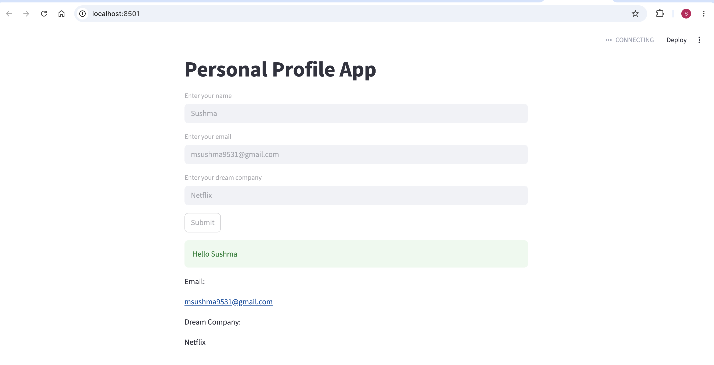

# Personal Profile App

A simple Streamlit application that collects user information and displays it after submission.

## Features

* Enter name
* Enter email
* Enter dream company
* Submit user information
* Input validation for empty fields
* Success and error messages

## Tech Stack

* Python
* Streamlit

## Run Locally

Install dependencies:

```bash
pip install -r requirements.txt
```

Start the application:

```bash
streamlit run app.py
```
## Screenshot

